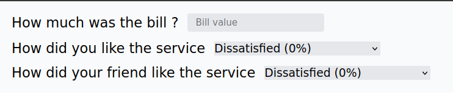

# Tip Calculator

The Tip Calculator is a simple web application that helps users determine how much to tip based on their dining experience. Users can input their total bill, rate the service, and the app calculates the suggested tip amount and the final bill.

## Features

- Input the total bill amount.
- Rate the service satisfaction.
- Automatically calculate the average tip based on user inputs.
- Display the total amount payable (bill + tip).
- Reset functionality to clear all inputs.

## 🛠️ Tech Stack

| Technology | Description |
|------------|-------------|
| React.js | For building the user interface |
| JavaScript | To handle calculations and interactivity | 
| HTML5 | Structure and semantic markup |
| TailwindCSS | Utility-first CSS framework for styling |

## Getting Started

1. Clone the repository to your local machine:
   ```bash
   git clone https://github.com/Briso10-dev/Tip-Calculator

2. Navigate to the project directory:
   ´´´bash
   cd Tip-Calculator

3. Install the required dependencies:
    ´´´bash
    npm install

4. Start the development server:
    ´´´bash
    npm start

Project Structure

    src/: Contains all the React components and logic.
    public/: Contains the HTML file and any static assets.

## 📸 Screenshots



## 🙏 Acknowledgments

- Thanks to all contributors who helped in building this project
- Inspiration from modern e-commerce platforms
- Tailwind CSS community for the excellent documentation

## 👥 Authors

- [@Briso-dev](https://github.com/Briso10-dev) - Frontend Development

## 📄 License

This project is open source and available under the [MIT License](LICENSE).